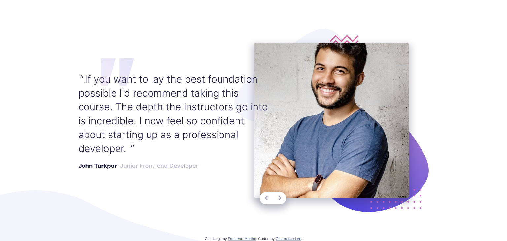

# Frontend Mentor - Coding bootcamp testimonials slider solution

This is a solution to the [Coding bootcamp testimonials slider challenge on Frontend Mentor](https://www.frontendmentor.io/challenges/coding-bootcamp-testimonials-slider-4FNyLA8JL). Frontend Mentor challenges help you improve your coding skills by building realistic projects.

## Table of contents

- [Overview](#overview)
  - [The challenge](#the-challenge)
  - [Screenshot](#screenshot)
  - [Links](#links)
- [My process](#my-process)
  - [Built with](#built-with)
- [Author](#author)

## Overview

### The challenge

Users should be able to:

- View the optimal layout for the component depending on their device's screen size
- Navigate the slider using either their mouse/trackpad or keyboard

### Screenshot

### Links

- [Solution](https://www.frontendmentor.io/solutions/responsive-testimonial-slider-using-basic-html-css-js-poCYYgSH_)
- [Live Site](https://cocky-mestorf-bd6c9d.netlify.app/)

## My process

### Built with

- Semantic HTML5 markup
- CSS custom properties
- Flexbox
- Mobile-first workflow

## Author

- LinkedIn - [Charmaine Lee](https://www.linkedin.com/in/charmainelee-huimin/)
- Frontend Mentor - [@charmainelhm](https://www.frontendmentor.io/profile/charmainelhm)
- Twitter - [@noodercob_ie](https://www.twitter.com/noodercob_ie)
